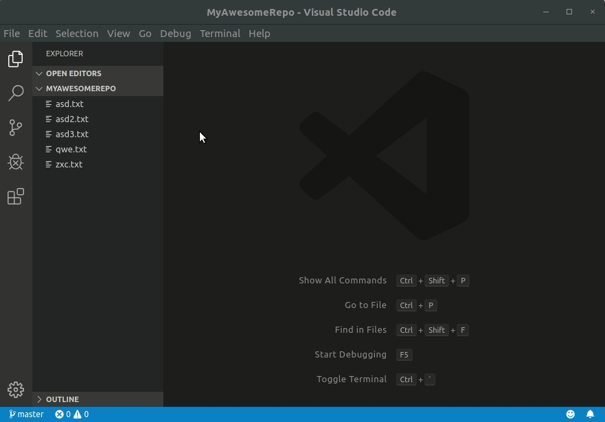

# Restore Git Branch Tabs

Restore opened tabs on a per git branch basis.

Opened editors are saved for each branch in the workspace. Switching branches saves the currently opened editors and restores the editors that were opened when last editing the new branch.

This extension was heavily based off of the work done by [Eric Amodio](https://github.com/eamodio), specifically his [Restore Editors](https://github.com/eamodio/vscode-restore-editors/blob/master/README.md) extension.

## Features

- Automatically saves editors when a git repository is detected in the workspace.

- New Branch Preserve Tabs: Option to keep tabs open when switching to a new branch instead of closing them.

- `Clear Saved Editors` command (`restoreGitBranchTabs:clear`) to clear all saved editors for every known branch.

- `Load Saved Editors` command (`restoreGitBranchTabs:load`) to manually load saved editors for the current branch.

- `Save Opened Editors` command (`restoreGitBranchTabs:save`) to manually save all open editors for the current branch.

## Extension Settings

| Name | Description
| ---- | -----------
|`restoreGitBranchTabs.newBranchPreserveTabs` | Preserve the current tabs when switching to a new branch
|`restoreGitBranchTabs.gitFolderLocation` | Path to directory of .git folder
|`restoreGitBranchTabs.delayUpdate` | Preserve the current tabs when switching to a new branch
|`restoreGitBranchTabs.debug` | Enable debug mode
|`restoreGitBranchTabs.outputLevel` | Specifies the verbosity of the output channel

## Known Issues

- View Columns are not used correctly meaning order of tabs isn't preserved.
- Extension doesn't activate if workspace is a subdirectory of a git repo (i.e. no .git in root of workspace)

## Future Features

- Command to open saved tabs for any branch
